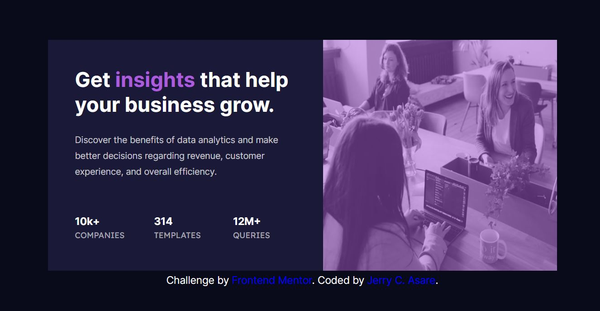

# Frontend Mentor - Stats preview card component solution

This is a solution to the [Stats preview card component challenge on Frontend Mentor](https://www.frontendmentor.io/challenges/stats-preview-card-component-8JqbgoU62). Frontend Mentor challenges help you improve your coding skills by building realistic projects.

## Table of contents

- [Overview](#overview)
  - [The challenge](#the-challenge)
  - [Screenshot](#screenshot)
  - [Links](#links)
- [My process](#my-process)
  - [Built with](#built-with)
  - [What I learned](#what-i-learned)
  - [Continued development](#continued-development)
  - [Useful resources](#useful-resources)
- [Author](#author)
- [Acknowledgments](#acknowledgments)


## Overview

### The challenge

Users should be able to:

- View the optimal layout depending on their device's screen size

### Screenshot




### Links

- Solution URL: [GitHub Repo](https://github.com/jcasare/FrontEndChallenges-stats-preview-component)
- Live Site URL: [Live Site](https://jcasare.github.io/FrontEndChallenges-stats-preview-component/)

## My process

### Built with

- Semantic HTML5 markup
- CSS custom properties
- CSS Grid


### What I learned

I learnt so much more about CSS Grid and how to re-arrange the order of grid items.

```css
.proud-of-this-css {
  display: grid;
  order:2;

}
```

### Continued development

I'd love to continue sharpening my CSS skills and also continue my Full Stack Web development journey.


### Useful resources

- [Reverse order of columns in CSS Grid layout](https://stackoverflow.com/questions/45383042/reverse-order-of-columns-in-css-grid-layout) - This helped me for understand how grid layouts work. I really liked this pattern and will use it going forward.


## Author

- GitHub - [Jerry C. Asare](https://www.github.com/jcasare)
- Frontend Mentor - [@jcasare](https://www.frontendmentor.io/profile/yourusername)
- Twitter - [@vhybesofficial](https://www.twitter.com/vhybesofficial)
- LinkedIn - [Jerry Comforter Asare](https://www.twitter.com/vhybesofficial)


## Acknowledgments

I'd like to thank Angela Yu for her wonderful training....and also to Frontend Mentor for these challenges.
